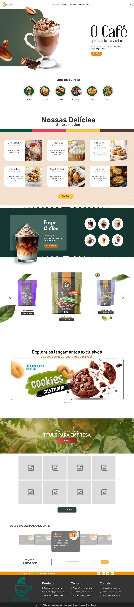

<h1 align="center">☕ JrCoffee - Site Oficial</h1>

  
  
  

  O site oficial da <strong>JrCoffee</strong>, trazendo informações sobre os produtos, missão e visão da marca.

---

## 🚀 Demonstração

🔗 **Acesse o site oficial**: [JrCoffee] Ainda Indisponivel.

 <!-- Atualize com o caminho correto da imagem -->

---

## 🌟 Sobre o projeto

O site da **JrCoffee** foi desenvolvido para apresentar a marca e os produtos de forma elegante e intuitiva. Ele inclui:

- 🌍 Página institucional com a história da JrCoffee  
- 🛒 Seção de produtos detalhada  
- 📱 Layout responsivo para todos os dispositivos  

---

## 🛠️ Tecnologias utilizadas

- **Frontend:** React.js  
- **Backend:** Node.js   
- **Estilização:** CSS  
- **Hospedagem:** Vercel  

